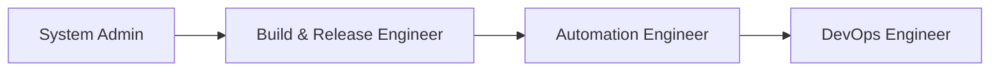

# Day 01 — Fundamentals of DevOps

### DevOps 90 Days Challenge

---

## Table of Contents

- [Overview](#overview)
- [What is DevOps?](#what-is-devops)
- [Core Pillars of DevOps](#core-pillars-of-devops)
- [Evolution of Roles](#evolution-of-roles-before-vs-after-devops)
- [Why DevOps Matters](#why-devops-matters)
- [Key Takeaways](#key-takeaways)
- [Progress Tracker](#progress-tracker)
- [Resources](#resources)

---

## Overview

|                |                                                                                                      |
| -------------- | ---------------------------------------------------------------------------------------------------- |
| **Day**        | 01 / 90                                                                                              |
| **Topic**      | Fundamentals of DevOps                                                                               |
| **Video**      | [Day-1 \| Fundamentals of DevOps \| Free DevOps Course](https://www.youtube.com/watch?v=Ou9j73aWgyE) |
| **Instructor** | Abhishek Veeramalla                                                                                  |
| **Series**     | [DevOps 90 Days Challenge](https://www.youtube.com/playlist?list=PLdpzxOOAlwvIc1TjTwopNSjRJkzES2ZXk) |
| **Status**     | Completed                                                                                            |

This session kicks off the 90-day challenge by laying the conceptual groundwork — what DevOps actually is, why it emerged, and how it reshaped traditional IT roles into what we now call a **DevOps Engineer**.

---

## What is DevOps?

> DevOps is a **culture and set of practices**, not a single tool — it exists to make software delivery faster, more reliable, and more efficient by bringing Development and Operations closer together.

At its heart, DevOps addresses one core problem: the traditional wall between the teams that _build_ software and the teams that _run_ it, which historically slowed delivery and caused friction.

---

## Core Pillars of DevOps

| Pillar                    | Description                                                                                                  |
| ------------------------- | ------------------------------------------------------------------------------------------------------------ |
| **Automation**            | Removing manual, repetitive steps from the delivery pipeline                                                 |
| **Quality**               | Ensuring code meets defined standards before reaching production                                             |
| **Continuous Monitoring** | Observing applications and infrastructure health post-deployment                                             |
| **Continuous Testing**    | Validating code at every stage of the pipeline, not just at the end                                          |
| **CI/CD**                 | Continuous Integration / Continuous Delivery — the backbone tying automation, testing, and delivery together |

---

## Evolution of Roles (Before vs. After DevOps)

| Traditional Role                       | Responsibility                                                                    |
| -------------------------------------- | --------------------------------------------------------------------------------- |
| **System Admin**                       | Managed physical/virtual servers (VMware, OpenStack, Xen)                         |
| **Build & Release Engineer (BRE)**     | Built and deployed code to servers                                                |
| **Server Admin → Automation Engineer** | Automated repetitive server/deployment tasks — the seed of the modern DevOps role |
| **DevOps Engineer**                    | Owns the full delivery lifecycle: automation, CI/CD, quality, monitoring          |

---

## Why DevOps Matters

- Bridges the gap between developers and operations teams
- Reduces "it works on my machine" issues
- Shortens release cycles for faster, more frequent shipping
- Improves reliability through consistent automation instead of manual, error-prone steps

---

## Key Takeaways

- DevOps is a **culture**, not a tool
- **Automation** is the foundation everything else (quality, monitoring, testing) is built on
- Understanding _why_ DevOps emerged makes the tools covered in later days much easier to appreciate

---

## Progress Tracker

- [x] Watched the video
- [x] Understood core DevOps concepts and motivation
- [x] Documented Day 01 notes
- [x] Move on to Day 02

---

## Resources

- [Day 01 Video](https://www.youtube.com/watch?v=Ou9j73aWgyE)
- [Full Playlist — DevOps 90 Days Challenge](https://www.youtube.com/playlist?list=PLdpzxOOAlwvIc1TjTwopNSjRJkzES2ZXk)

---

_Part of my 90 Days DevOps Challenge journey — documenting daily learnings as I go._

